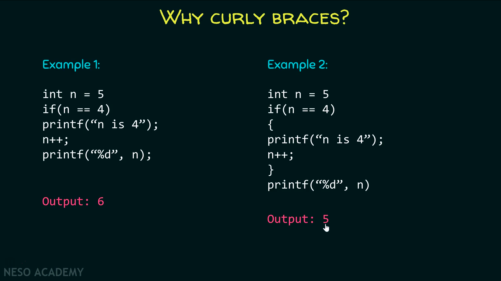

# if, else if, else

কন্ডিশন True হলে কিছু কোড এবং False হলে অন্য কিছু কোড execution এর জন্য C তে if...else স্টেটমেন্ট ব্যবহৃত হয়। আর nested if..else হচ্ছে প্রধান একটা if যদি true হয় তাহলে ভেতরে আরো কিছু  if condition থাকবে। প্রথম if false হলে তারপর যদি else if থাকে সেটা যাচাই হবে, সেটাও মিথ্যা হলে একদম শেষে else এর কোড execute হবে। তবে যেই মূহুর্তেই true পাওয়া যাবে, তার পর থেকে কোড(যদি else if অথবা else থাকে) আর execute হবেনা।  এটা if এর short circuit notation.

যদি সবগুলো কন্ডিশন চেক করাতে হয় তাহলে সবগুলোই if দিয়ে লিখতে হবে তাহলে একটা if statement true হলেও short circuit  হবেনা বরং যতগুলো if statement থাকবে সবগুলোই execute  হবে।


```c
  if (test_expression) {
    // run code if test expression is true

    if (test_expression2) {
      // Statements inside the body of nested "if"
    }
  } else if (test_expression3) {
    // statement(s)
  } else {
    // run code if test_expression, test_expression2 & test_expression3 are false
  }
```

একাধিক statement এর জন্য `{}` দিতে হয়, শুধুমাত্র একটা statement হলে `{}` না দিলেও চলে। if এর পরের immediate statement টা if এর অংশ হিসেবে গণ্য হবে, তারপরের গুলা হবেনা।



