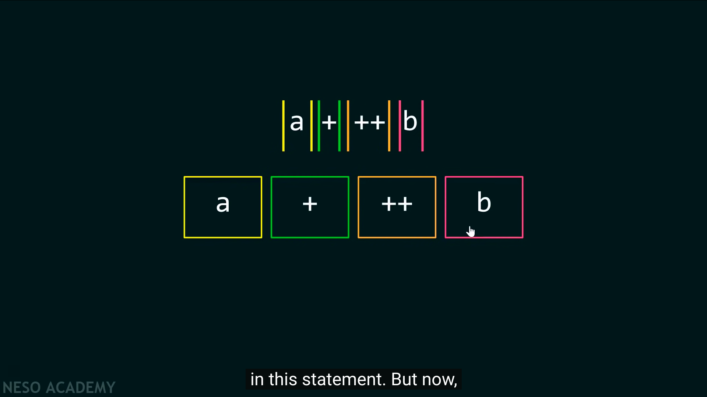

# operator

operator এর কাজ হলো operand এর উপর বিভিন্ন অপারেশন চালানো। `a+b`⁠ এখানে `a` এবং `b` হলো operand, `+` হলো operator. operand এবং operator মিলে যে কাজ করে তাকে expression বলে। C তে প্রতিটা expression এর শেষে সেমিকোলন দিতে হয়। সাধারণত expression এর মাধ্যমে variable এ ভ্যালু store করা হয়,  এবং expression এর আউটপুট constant ভ্যালু হয়।

&#x20;একটা expression নিজেও operand হতে পারে। যেমন- `(4-3) + (2-1)`

`<operand> <operator> <operand>`এই সিনট্যাক্স কে infix বলে। এটা binary operator এর ফরম্যাট। &#x20;

`<operator> <operand>`এই সিনট্যাক্স কে prefix বলে। এটা unary operator এর ফরম্যাট। &#x20;

`<operand> <operator>`এই সিনট্যাক্স কে postfix বলে। এটাও unary operator এর ফরম্যাট। &#x20;

কোন expression এর operand গুলো ভিন্ন ধরনের ডাটা টাইপ নিয়ে গঠিত হলে অর্থাৎ mixed expression হলে সাধারণত যে operand এর ডাটা সাইজ বেশি ফলাফল সেটাতে কনভার্ট হয়ে যায় অর্থাৎ data widening হয়। যেমন:&#x20;

```c
char + int = int
double + int = double
long int - int = long int
```


<details>

<summary>L Value, R Value</summary>

lvalue মানে হলো এটা data store করতে পারে, এর একটা মেমোরি এড্রেস আছে, এবং এটা অবশ্যই একটা variable হবে, কোনোরকম constant, expression, function হবে না।

rvalue তে কোনোরকম data store করার সক্ষমতা থাকেনা, এগুলো constant, expression, function হয়।

</details>

<details>

<summary>Token Generation</summary>

Compilation process এর প্রথম ধাপ Lexical analysis. Lexical analyzer(source code স্ক্যান করে)  token এ কনভার্ট করে (যদি lexemes পাওয়া যায়)।  lexemes=  meaningful sequence of characters (highest). C তে বিভিন্ন ধরনের token আছে। যেমন:

```
1) Keywords: 
Examples- for, while, if etc.

2) Identifier
Examples- Variable name, function name etc.

3) Operators:
Examples- '+', '++', '-' etc.

4) Separators:
Examples- ', ' ';' etc
```


</details>

<details>

<summary>Increment and Decrement operator <mark style="color:orange;"><code>++ --</code></mark></summary>

এইগুলো একটা ভেরিয়েবলের ভ্যালুকে এক করে বাড়ায় বা কমায়। ধরি `a = 5;` সুতরাং, `a++` এর মানে হলো `a = a + 1;`

এই operator গুলোর সাথে **rvalue** দেয়া যায় না। `a++` হলো `a = a + 1;` এখানে `a` হলো lvalue, `a+1` হলো rvalue `(a+b)++` দিলে `(a+b)=(a+b)+1` হবে। এখানে বামদিকে `(a+b)` একটা  rvalue যেটা data store করতে পারেনা, এজন্য Increment এবং decrement operator এর সাথে rvalue দেয়া যায় না।

&#x20;`a++` হলো **post-increment operator বা postfix**. a = 5; এবং x = a++; দিলে x এর value হিসেবে আগে 5 assign হবে, তারপর a এর ভ্যালু increment হবে। এটা কোনো ভ্যারিয়েবলে ডাটা  assign এর সময়কার নিয়ম। &#x20;

```c
#include <stdio.h>  
  
int main()  
{  
  int a = 5;  
  int x;
  
    x = a++;  
  
    printf("x = %d\n", x); 
		
    // output x = 5, not 6 
  
  return 0;  
}
```


`++a` হলো **pre-increment operator বা prefix** , a = 5; এবং x = ++a; হলে এখানে আগে a এর ভ্যালু increment হয়ে 6 হবে, এবং তারপর x এর value হিসেবে assign হবে। এটাও কোনো ভ্যারিয়েবলে ডাটা  assign এর সময়কার নিয়ম। &#x20;

```c
#include <stdio.h>  
  
int main()  
{  
  int a = 5;  
  int x;
  
    x = ++a;  
  
    printf("x = %d\n", x); 
		
    // output x = 6, not 5
  
   return 0;  
}
```


Equation এর ক্ষেত্রে  **post-increment operator** আগে value **** কে Equation এ পাঠায়, তারপর ভ্যালু increment হবে।  যেমন- `a=5, b=5` হলে `a+++b` এর আউটপুট হবে 10.&#x20;




Equation এর ক্ষেত্রে  **pre-increment operator** আগে ভ্যালু increment হবে, তারপর value **** কে Equation এ পাঠায়,&#x20;

যেমন- `a=5, b=5` হলে `a+++b` এর আউটপুট হবে 10.

</details>

<details>

<summary>Assignment Operator</summary>


এটা দিয়ে variable এ value assign করার সময় lvalue এবং rvalue খেয়াল রাখতে হয়।

`a = a + b;` এটা সঠিক, `a + b = a;` এটা ভুল।

#### Shorthand (Arithmetic Assignment Operators)

আগে (যোগ/বিয়োগ/গুণ/ভাগ) করো, তারপর R value কে L value তে assign করো।


</details>
