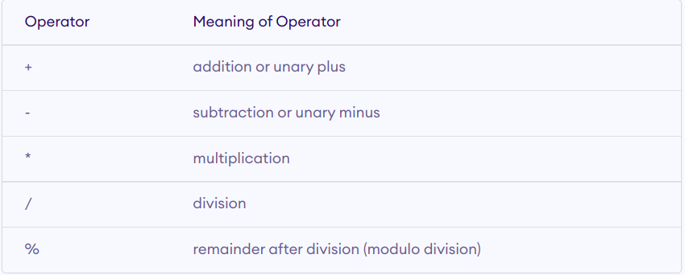

# arithmetic operator

&#x20;একটা সংখ্যা  ধনাত্মক নাকি ঋণাত্মক সেটা নির্ধারণ করতে `+ -` কে unary operator হিসেবে ব্যবহার করা যায়। আবার একাধিক operand কে যোগ বা বিয়োগ করতেও `+ -` কে binary operator হিসেবে ব্যবহার করা যায়।

`/` এর মাধ্যমে Quotient(ভাগফল) বের হয়, এই operator এর দ্বিতীয় operand কখনোই শূন্য হতে পারবে না।

&#x20;`%` এর মাধ্যমে Remainder(ভাগশেষ) বের হয়। `%`  modulus means the remainder part of integer division. modulus operator এর সাথে int বাদে অন্য ডাটা টাইপ ব্যবহার করা যায় না এবং দ্বিতীয় operand শূন্য হতে পারবে না। এর রিটার্ন ভ্যালু ধনাত্মক নাকি ঋণাত্মক হবে সেটা প্রথম operand এর উপর নির্ভর করে।

`*` `/` `%` এর অগ্রাধিকার (precedence) বেশি , এরপরের সিরিয়ালে আসবে `+` `-` ( উভয়েরই associativity বাম থেকে ডানে)। precedence একই লেভেলের হলে associativity দিয়ে হিসাব হয়। `*` `/` `%` এরা একই লেভেলের, এদের মধ্যে যে বামদিকে আসবে তার কাজই আগে হবে।
