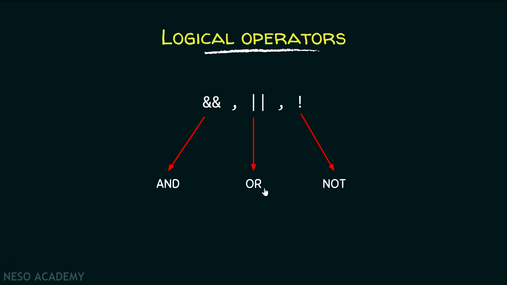
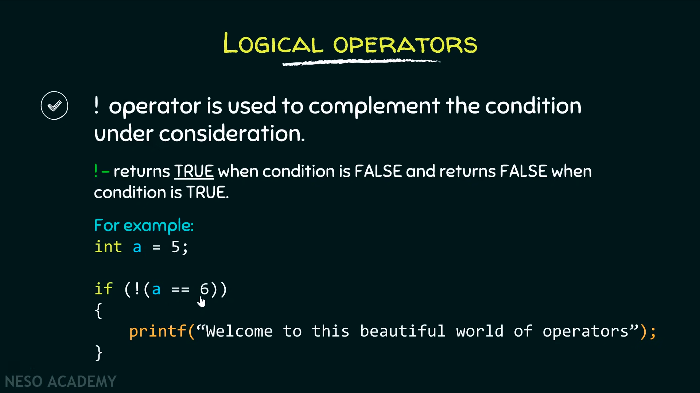

# logical operator



`&&` এবং `||` কমপক্ষে দুইটা কন্ডিশনকে combine করে, তাই এরা বাইনারী operator। `&&` এর বেলায় দুইটা কন্ডিশনই সত্য কিনা যাচাই করা হয়। যখনই একটা কন্ডিশন false পাবে, এরপরের কন্ডিশন আর evaluate করা হবেনা, একে short circuit বলে। && এর দুইপাশে দুইটা কন্ডিশন না হয়ে যদি একটা expression থাকে এবং যদি এটার ভ্যালু শূন্য এর বেশি হয়, তাহলে expression হওয়া সত্ত্বেও আউটপুট true হবে।&#x20;

&#x20;`||` এর বেলায় কমপক্ষে একটা কন্ডিশন সত্য কিনা সেটা যাচাই করা হয়। যখনই একটা কন্ডিশন true পাবে, এরপরের কন্ডিশন আর evaluate করা হবেনা, যা  `||` এর short circuit।

`!` logical not operator হল একটা unary operator এবং এটা prefix position এ বসে। relational operator এর মতই logical operator true, false এর আউটপুট বুলিয়ানে  দেয়, true= 1, false= 0

`!` logical not operator  কন্ডিশনকে complement হিসেবে দেখে। (complement= true becomes false, false becomes true). operand যদি true হয় তাহলে `!` operator আউটপুট  false বা 0 দিবে। একইভাবে, operand যদি false হয় তাহলে `!` operator আউটপুট  true বা 1 দিবে। একটা গুরুত্বপূর্ণ ব্যাপার হলো  operand যদি 0 না হয়ে অন্য যেকোনো সংখ্যা হয় তাহলে সেটাও true বলে বিবেচ্য হবে।&#x20;

`!!` এভাবে দুইটা logical not operator দিলে সেটা yes বলে বিবেচ্য হয় এবং complement হয়না।



```c
#include <stdio.h>

int main() {
    int a = 5, b = 7, c;
    c = !(a+b);
    printf("%d \n", c);
    
    // আউটপুট হবে 0,
    // c = !12
    // !12 complement হয়ে 0 হবে, কারণ 1 এর বেশি হলেই সেটা true হিসেবে বিবেচ্য 
    
    return 0;
}
```

