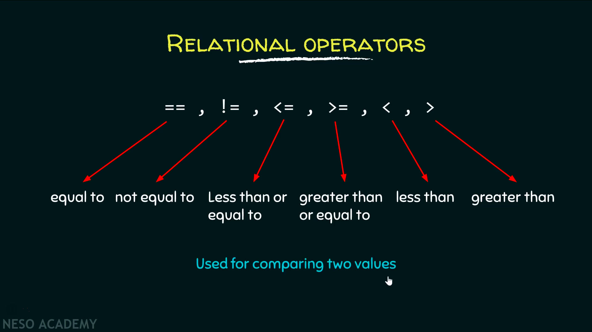

# Relational Operator

দুইটি operand এর মধ্যে তুলনা করতে relational operator `== != <= >= < >` ব্যবহার করা হয়। এদের সবারই দুইটা operand লাগে তাই এরা বাইনারী operator.  এরা হয় true নয়তো false আউটপুট দিবে। তাই দুইটা operand সত্য নাকি মিথ্যা সেটা বের করতে এই operator ব্যবহার করা হয়। এই operator গুলো সবসময় integer এ আউটপুট দেয়, true এর মান 1, false এর মান 0 হয়।

relational operator গুলোর মাঝখানে কোনরকম স্পেস দেয়া যাবেনা, যেমন এখানে `<=` দুইটার মাঝে স্পেস দিলে সেটা ভুল হবে।

