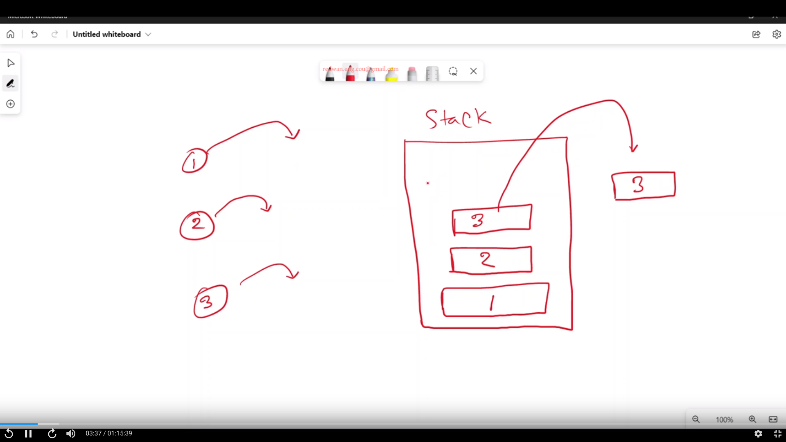

# recursion

যখন একটা function নিজেকে directly অথবা indirectly call করে তাকে recursion বলে। কাজকে ছোট করার জন্য recursion ব্যবহার করা হয়। recursion এ একটা কাজ নিজে করে দিতে হয় এবং পরের কাজের শুরু টা recursion কে দিয়ে দিতে হয়। recursion বোঝার জন্য stack বোঝা জরুরি কারণ যেকোনো function call করা হলেই সেটা stack memory তে চলে যায়।&#x20;



```cpp
#include "iostream"
#include "string"
using namespace std;

void user() {
  cout << "user function started" << endl;
  cout << "user function ended" << endl;
}

int main() {
  cout << "main function started" << endl;
  user();
  cout << "main function ended" << endl;
  return 0;
}
```

```
output:
main function started
user function started
user function ended
main function ended
```

এখানে প্রথমেই main function শুরু হয়েছে কারণ এটা বর্তমানে stack এ সবচেয়ে top position এ আছে। কিন্ত তারপরেই user function call করার কারণে main function hold হয়ে যাবে কারণ এখন top position এ user function আছে। user function এর execution শেষ হবার পর এটা destroy হয়ে যায় এবং main function আবার top position এ চলে আসে এবং resume হয়ে বাকি statement গুলো execute করে।

একটা function এর ভেতরে যখন সেই function কেই আবার call করা হয় এটা endlessly নিজেকে call করতেই থাকবে এবং stack memory এর উপর একই function বার বার আসতে থাকবে। যদি এটাকে না থামানো হয় তাহলে একসময় stack এর boundary cross করে ফেলবে অর্থাৎ stack overflow হবে কারণ আগের টা call করা হলেও বন্ধ করা হয়নাই এ অবস্থায় নতুনভাবে আবার call করা হয়েছে। যে condition এর উপর ভিত্তি করে recursion কে থামাতে হয় তাকে base condition বলে।&#x20;

এখন base condition apply করার পালা। এটা মূলত একটা if block হয়ে থাকে। নিচের কোডে n এর argument 1 দিয়ে main function থেকে user function কে call করা হয়েছে। এরপর  base condition হিসেবে বলা হয়েছে n এর value যদি 4 হয় তাহলে return করে function শেষ করে দাও। যেহেতু বর্তমানে n এর মান হলো 1, তাই এই if block টা execute হবে না। এর পরের লাইনে n এর value print করতে বলা হয়েছে। এর পরের লাইনেই আমাদের recursion এর খেলা শুরু, n এর সাথে 1 যোগ করে  user function কে আবার call করা হয়েছে। এভাবে user function নিজেকে বার বার call করতেই থাকবে এবং stack memory তে নিচের ডায়াগ্রাম এর মত অবস্থা হবে।

.png>)

behind the scene, n এর মান যখন 4 হবে তখন ই base condition এর if block execute হয়ে user function with 4 কে return করে শেষ করে দিবে এতে করে stack memory থেকে user function with 4 destroy হয়ে যাবে। অন্য সব function গুলো কিন্ত  `user(n + 1);` এই জায়গায় এসে hold হয়ে ছিল। এবার একে একে  user function with 3,  user function with 2,  user function with 1 এগুলো `user(n + 1);` এখানে এসে resume হয়ে নিচের দিকে যাবে এবং "resumed" print করবে এরপর যখন দেখবে নিচে আর কিছু নাই তখন destroy হয়ে যাবে এবং সবার শেষে main function destroy হয়ে যাবে।

```cpp
#include "iostream"
using namespace std;

void user(int n) {
  // base condition
  if (n == 4) {
    return;
  }
  cout << n << endl;
  user(n + 1);
  // recursion
  cout << "resumed" << endl;
}

int main() {
  cout << "main function started" << endl;
  user(1);
  cout << "main function ended" << endl;
  return 0;
}
```

hold and resume এর ব্যাপার টা বুঝতে আরেকটা কোড দেখা যাক। এখানে n এর value print করার আগেই recursion statement দেয়া হয়েছে। user function with 1- user function with 2 - user function with 3- user function with 4 এভাবে সিরিয়ালই call হতে থাকবে। আবারো একই ডায়াগ্রাম দেখে ব্যাপার টা বুঝতে হবে।

.png>)

&#x20;n এর মান যখন 4 হবে তখন ই base condition এর if block execute হয়ে user function with 4 কে return করে শেষ করে দিবে।  stack memory তে user function with 4 বলে এখন আর কিছু থাকবে না। এইবার অন্য সব function গুলো একে একে resume হবে। খেয়াল করলে দেখা যাবে function গুলো 3-2-1 এই সিরিয়ালে stack memory তে আছে এবং resume হবার সময় এভাবেই হবে তাই n এর value উল্টা হয়ে print হবে।

```cpp
#include "iostream"
using namespace std;

void user(int n) {
  if (n == 4) {
    return;
  }
  user(n + 1);
  cout << n << endl;
}

int main() {
  cout << "main function started" << endl;
  user(1);
  cout << "main function ended" << endl;
  return 0;
}
```
