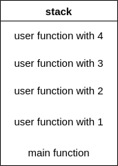

# recursion

যখন একটা function নিজেকে directly অথবা indirectly call করে তাকে recursion বলে। কাজকে ছোট করার জন্য recursion ব্যবহার করা হয়। যেকোনো function call করা হলেই সেটা stack memory তে চলে যায়।&#x20;



```cpp
#include "iostream"
#include "string"
using namespace std;

void user() {
  cout << "user function started" << endl;
  cout << "user function ended" << endl;
}

int main() {
  cout << "main function started" << endl;
  user();
  cout << "main function ended" << endl;
  return 0;
}
```

```
output:
main function started
user function started
user function ended
main function ended
```

এখানে প্রথমেই main function শুরু হয়েছে কারণ এটা বর্তমানে stack এ সবচেয়ে top position এ আছে। কিন্ত তারপরেই user function call করার কারণে main function hold হয়ে যাবে কারণ এখন top position এ user function আছে। user function এর execution শেষ হবার পর এটা destroy হয়ে যায় এবং main function আবার top position এ চলে আসে এবং resume হয়ে বাকি statement গুলো execute করে।

একটা function এর ভেতরে যখন সেই function কেই আবার call করা হয় এটা endlessly নিজেকে call করতেই থাকবে এবং stack memory এর উপর একই function বার বার আসতে থাকবে। যদি এটাকে না থামানো হয় তাহলে একসময় stack এর boundary cross করে ফেলবে অর্থাৎ stack overflow হবে কারণ আগের টা call করা হলেও বন্ধ করা হয়নাই এ অবস্থায় নতুনভাবে আবার call করা হয়েছে। যে condition এর উপর ভিত্তি করে recursion কে থামাতে হয় তাকে base condition বলে।&#x20;

```cpp
#include "cctype"
#include "iostream"
#include "string"
using namespace std;

void user() {
  user();
  // it will overflow
}

int main() {
  cout << "main function started" << endl;
  user();
  cout << "main function ended" << endl;
  return 0;
}
```
