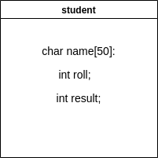

# structure

<details>

<summary>why structure?</summary>

ধরা যাক আমাকে ৫০ জন ছাত্রের রেজাল্ট নিয়ে কাজ করতে হবে। যে সর্বোচ্চ নাম্বার পাবে তার নাম, রোল, নাম্বার প্রিন্ট করতে হবে। এই কাজ ট্রাডিশনাল ভাবী করলে আমার হয় ১৫০ টা variable লাগবে অথবা  50 size এর ৩টা array লাগবে। variable বা array যেটাই ব্যবহার করি এখানে মূল সমস্যা হলো একটার সাথে অন্যটার কোনো কানেকশন নাই। variable একটার সাথে অন্যটার যেমন কোনো কানেকশন নাই, একইভাবে একটা array এর সাথে অন্যগুলোর কোনো সম্পর্ক নাই। অথচ আমার একজন ছাত্রের নাম, রোল, নাম্বার প্রিন্ট করতে হবে যেটা রিলেশনাল ডাটা না হলে ম্যানেজ করা প্রায় অসম্ভব। structure এখানে rescuer হিসেবে কাজ করে। এটা variable grouping করতে পারে যার ফলে একটা variable কার সাথে connected তা জানা যায়।

</details>



```c
struct student {
//basic syntax
};

struct student {
  char name[50];
  int id;
  int roll;
  // members of the structure
}//variable can be created here;
```

<details>

<summary>structure এর structure</summary>

structure কে অনেকে user defined data type বলে। বাড়ি কিংবা ব্রিজ বানাতে সাধারণত ইট, বালু, রড, সিমেন্ট লাগে, এইগুলো একত্র করে ইচ্ছামত কাঠামো দাঁড় করানো যায়। একইভাবে, structure C এর built-in data type গুলোকে mix করে ইচ্ছামত data type বানাতে পারে।&#x20;

</details>

<details>

<summary>not to do in structure</summary>

* structure এর ব্লকের ভেতর variable এর initial value দেয়া যাবে না, এগুলো দিয়ে data type বানানো হয়, এখানে ভ্যালু দেয়া illogical। এমনটা করলে structure এর আন্ডারে যে যে মেম্বার থাকবে সবার ভ্যালু এক হয়ে যাবে। আর যেহেতু structure একটা custom data type তাই data type এ কোনো default value থাকা logical না।&#x20;
* array তে যেমন শুধুমাত্র declare করার সময় initialize করা যায়, একইভাবে structure variable declare এর সময়েই initialize করতে হয়।

</details>
