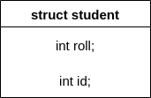

# structure



ধরা যাক আমাকে ৫০ জন ছাত্রের রেজাল্ট নিয়ে কাজ করতে হবে। যে সর্বোচ্চ নাম্বার পাবে তার নাম, রোল, নাম্বার প্রিন্ট করতে হবে। এই কাজ ট্রাডিশনাল ভাবে করলে  হয় ১৫০ টা variable লাগবে অথবা 50 size এর ৩টা array লাগবে। variable বা array যেটাই ব্যবহার করা হোক না কেন, এখানে মূল সমস্যা হলো একটার সাথে অন্যটার কোনো সম্পর্ক নাই। variable একটার সাথে অন্যটার যেমন কোনো সম্পর্ক নাই, একইভাবে একটা array এর সাথে অন্যগুলোর কোনো সম্পর্ক নাই। অথচ আমার একজন ছাত্রের নাম, রোল, নাম্বার প্রিন্ট করতে হবে যেটা রিলেশনাল ডাটা না হলে ম্যানেজ করা প্রায় অসম্ভব। structure এখানে rescuer হিসেবে কাজ করে। এটা variable grouping করতে পারে যার ফলে একটা variable কার সাথে connected তা জানা যায়।





structure কে অনেকে user defined data type বলে। বাড়ি কিংবা ব্রিজ বানাতে সাধারণত ইট, বালু, রড, সিমেন্ট লাগে, এইগুলো একত্র করে ইচ্ছামত কাঠামো দাঁড় করানো যায়। একইভাবে, structure C এর built-in data type গুলোকে mix করে ইচ্ছামত data type বানাতে পারে।&#x20;



```c
struct student {
//basic syntax
};

struct student {
  char name[50];
  int id;
  int roll;
  // members of the structure
}//variable can be created here;
```





* structure এর ব্লকের ভেতর variable এর initial value দেয়া যাবে না, এগুলো দিয়ে data type বানানো হয়, এখানে ভ্যালু দেয়া illogical। এমনটা করলে structure এর আন্ডারে যে যে মেম্বার থাকবে সবার ভ্যালু এক হয়ে যাবে। আর যেহেতু structure একটা custom data type তাই data type এ কোনো default value থাকা logical না।&#x20;
* array তে যেমন শুধুমাত্র declare করার সময় initialize করা যায়, একইভাবে structure variable declare এর সময়েই initialize করতে হয়।





একটা structure এর ভেতর যতগুলো member আছে তাদের data type অনুযায়ী মোট যত size হয় ঠিক ততটুকুই একটা structure variable এর size. যেমন, দুইটা  int member থাকলে 8 byte size লাগবে।



```cpp
#include "iostream"
#include "string"

using namespace std;

struct test {
  int one;
  char arr[100];
};

int main() {
  struct test dump;
  cout << sizeof(dump) << endl;
  // result 104
  return 0;
}
```





অন্যান্য সব data type এর মত structure এর pointer বানানো যায় যেটা নিচের ডায়াগ্রামে দেখা যাচ্ছে।&#x20;


structure এর member কে dereference করতে সবচেয়ে বেশি ভুল হয়।&#x20;

* ptr.roll বলে কিছু নাই কারণ ptr হলো pointer, তাই এর সাথে structure এর মত . ব্যবহার করা যায় না,  ptr এর মাঝে পুরো structure এর address আছে, স্পেসিফিক ভাবে কোনো structure member এর নাই।&#x20;
* আবার \*ptr.roll বলেও কিছু নাই কারণ এটা behind the scene  \*(ptr.roll) এভাবে ইন্টারপ্রেট হয় এবং একটু আগের ব্যাখ্যা অনুযায়ী ptr.roll এর অস্ত্বিত্ব নাই তাই একে dereference করা যাবে না।
* এজন্য আগে ptr কে dereference করতে হয় তারপর তার ভেতরের structure member কে access করা যায়। **go inside ptr and then find roll:** `(*ptr).roll`
* shorthand হিসেবে `->` এই অপারেটর ব্যবহার করা যায়। `ptr -> roll`



```cpp
#include "iostream"
#include "string"

using namespace std;

struct test {
  int one;
  int two;
};

int main() {
  struct test dump;
  struct test *ptr = &dump;
  (*ptr).one = 20;
  ptr->two = 50;
  cout << dump.one << " " << dump.two << endl;
  return 0;
}
```


