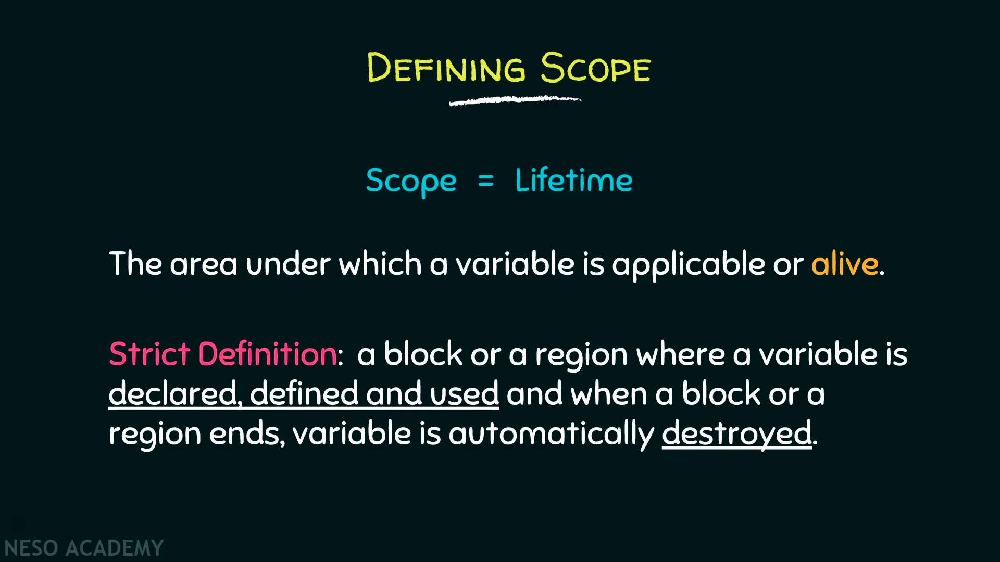
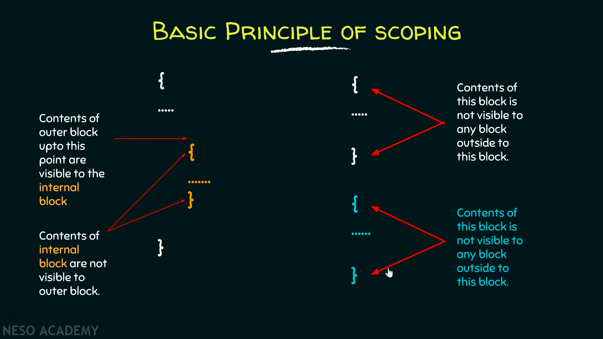
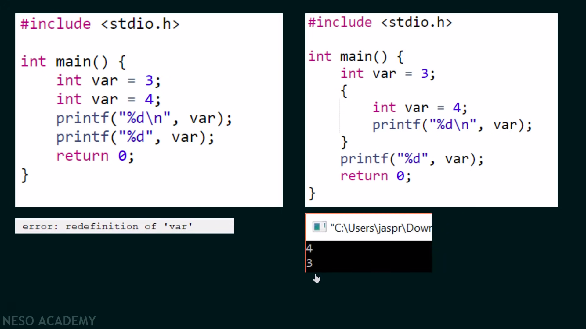

# variable scope

একটা variable তার execution শেষ করলে destroyed হয়ে যায়, পরবর্তিতে এই variable কে আবার address করলে সে আবার তৈরি হয়। এভাবে প্রতিবার execution শেষে variable গায়েব হয়ে যায় যেটাকে automatic variable বলা যায়।

একটা  function এর variable শুধুমাত্র সেই function এর জন্য local scoped. তাকে ওই function এর বাইরে access করা যাবেনা। একটা variable সব function এর বাইরে থাকলে তাকে global variable বলা যায়। global variable এর সমস্যা হলো এটা সবসময় মেমোরি দখল করে রাখে, automatic বা local variable এর মত function execute শেষে destroy হয়ে যায় না। আরেকটা সমস্যা হলো প্রোগ্রাম যদি অনেক বড় হয় তাহলে অনাকাঙ্ক্ষিত ভাবে কোনো এক জায়গায় global variable এর value পরিবর্তন হয়ে bug এর কারণ হতে পারে।&#x20;

একই ব্লকে একই নামে একাধিক variable কোনোভাবেই declare(redefinition) করা যাবেনা, তবে ভিন্ন ব্লকে করা যাবে। internal ব্লক চাইলে বাইরের ব্লকের access নিতে পারে, কিন্ত বাইরের ব্লকের কাছে internal ব্লকের কোন access থাকেনা। external ব্লকে এবং internal ব্লকে একই নামে দুইটা variable থাকলে internal ব্লক তার immediate টাকে গুরুত্ব বেশি দিবে।&#x20;

